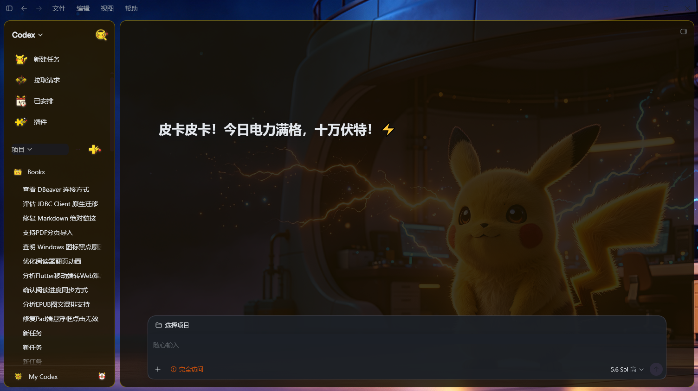

# ChatGPT Pika Theme

为 Windows Codex / ChatGPT 桌面端制作的非官方皮卡丘主题包，基于
[Fei-Away/Codex-Dream-Skin](https://github.com/Fei-Away/Codex-Dream-Skin) 的
Codex Dream Skin 运行。

主题包包含：

- `皮卡丘·电光实验室（浅色）`
- `皮卡丘·电光实验室（深色）`
- 9 枚自绘卡通侧边栏图标
- 彼此留有间距的圆角侧边栏与会话主面板，并保留克制的皮卡丘黄色调
- 与皮卡丘黄、琥珀边线和深棕文字统一的摘要卡片与右侧工具栏
- 收起左侧项目栏时保持主题、背景图和主面板圆角，不再回退到原生配色
- 深色任务页、输入框底栏和输出面板文字兼容
- 根据 Codex 实际侧栏行高自动缩放的图标（约 `28–34px`）
- 当前公开版 Dream Skin 所需的卡通图标 / 首页文案兼容补丁
- 一键安装、切换和卸载脚本

## Codex 实际效果

### 浅色主题


### 深色主题



## 背景预览


## 全新 Windows 电脑：从零安装

下面是完整流程。不要只运行本仓库的 `install.ps1`：全新电脑还需要先安装
Node.js 和 Codex Dream Skin。

### 1. 准备 Codex 和 Node.js

1. Windows 10 或 Windows 11。
2. 从 Microsoft Store 安装官方 Codex，并至少成功运行一次。
3. 安装 Node.js 22 或更高版本（推荐当前 LTS）。
4. 安装 PowerShell 7，使 `pwsh` 命令可用。

先检查版本：

```powershell
node --version
pwsh --version
```

如果 Node.js 低于 22，可使用：

```powershell
winget install OpenJS.NodeJS.LTS
```

也可以把 Node.js 官方 ZIP 解压到 `~/tools`，但必须把解压目录加入用户
`PATH`，确保新开的 PowerShell 中 `node --version` 能找到 22+。

### 2. 可选：只给本次下载设置代理

下面的变量只影响当前 PowerShell，不会修改全局 Git 或系统代理：

```powershell
$env:HTTP_PROXY  = 'http://127.0.0.1:10808'
$env:HTTPS_PROXY = 'http://127.0.0.1:10808'
$env:ALL_PROXY   = 'http://127.0.0.1:10808'
```

端口请按自己的本地代理修改。

### 3. 把工具克隆到 `~/tools`

```powershell
New-Item -ItemType Directory -Force "$HOME\tools" | Out-Null

git clone https://github.com/Fei-Away/Codex-Dream-Skin.git `
  "$HOME\tools\Codex-Dream-Skin"

git clone https://github.com/mini2436/chatgpt-pika-theme.git `
  "$HOME\tools\chatgpt-pika-theme"
```

### 4. 安装 Codex Dream Skin

Dream Skin 的首次安装事务要求 Codex 完全退出。请保存未发送的输入，关闭
Codex，然后在独立的 PowerShell / Windows Terminal 中运行：

```powershell
cd "$HOME\tools\Codex-Dream-Skin\windows"

powershell.exe -NoProfile -ExecutionPolicy Bypass `
  -File .\scripts\install-dream-skin.ps1

powershell.exe -NoProfile -ExecutionPolicy Bypass `
  -File "$env:LOCALAPPDATA\CodexDreamSkin\engine\scripts\start-dream-skin.ps1"
```

新版 Dream Skin 会把受管运行副本安装到：

```text
%LOCALAPPDATA%\CodexDreamSkin\engine
```

仓库源码放在 `~/tools`；运行状态、主题、备份和快捷方式按 Dream Skin 的安全
设计保留在 `%LOCALAPPDATA%\CodexDreamSkin`。

### 5. 安装并应用皮卡丘主题

Codex 重新打开后运行：

```powershell
cd "$HOME\tools\chatgpt-pika-theme"
pwsh -NoProfile -ExecutionPolicy Bypass -File .\scripts\install.ps1 -Apply light
```

`install.ps1` 会自动：

1. 优先发现新版 `%LOCALAPPDATA%\CodexDreamSkin\engine`，同时兼容旧的
   `%LOCALAPPDATA%\CodexDreamSkinStudio`。
2. 检查 Dream Skin 是否能把 `icons.style` 和 `copy.homeTitle` 传给渲染器。
3. 对当前公开版缺少的接口做有锚点检查的最小兼容补丁。
4. 用 Node.js `--check` 验证补丁后的 JavaScript，再写入文件。
5. 备份原文件、安装浅色和深色主题、嵌入 9 枚 PNG 与圆角黄色面板样式，
   并应用所选变体。
6. 使用 Windows PowerShell 重新应用主题，避免 PowerShell 7 无法加载
   `Get-AppxPackage` 的问题。

兼容补丁只在目标代码结构完全匹配时执行；遇到更新后不认识的 Studio 版本会
安全停止，不会猜测性改写。

## 已安装 Dream Skin：快速安装

如果 Dream Skin 已经安装并能正常启动，只需：

```powershell
git clone https://github.com/mini2436/chatgpt-pika-theme.git
cd chatgpt-pika-theme
pwsh -NoProfile -ExecutionPolicy Bypass -File .\scripts\install.ps1 -Apply light
```

`-Apply` 支持：

- `light`：安装后立即应用浅色主题，默认值。
- `dark`：安装后立即应用深色主题。
- `none`：只安装，不切换当前主题。

如暂时不希望重新应用皮肤，可追加 `-NoRestart`。

## 自定义 Dream Skin 路径

脚本会自动发现当前和旧版默认目录。如果使用其他目录：

```powershell
pwsh -NoProfile -ExecutionPolicy Bypass -File .\scripts\install.ps1 `
  -StudioRoot 'D:\Apps\CodexDreamSkinStudio' -Apply dark
```

## 切换主题

通过系统托盘切换：

```text
Codex Dream Skin
  → 已保存主题
  → 皮卡丘·电光实验室（浅色 / 深色）
  → 应用或重新应用
```

如果界面没有立即刷新，请使用 Windows PowerShell（不要在这里改成 `pwsh`）：

```powershell
powershell.exe -NoProfile -ExecutionPolicy Bypass `
  -File "$env:LOCALAPPDATA\CodexDreamSkin\engine\scripts\start-dream-skin.ps1"
```

## 高 DPI / 2K / 4K 显示器

旧版本把图标固定为 `40×40 CSS px`。在 2560×1440、Windows 125% 缩放时，
Codex 侧栏行高实测只有约 `29–30 CSS px`，图标会比行高多出约 10px，从而上下
拥挤。

当前版本使用 Codex 的 `--height-token-row` 计算图标大小，并限制在
`28–34px`。它跟随 Codex 的侧栏密度，而不是假定某个显示器分辨率，因此更适合
1080p、2K、4K 和不同 Windows 缩放比例。

## 文件位置

| 内容 | 默认位置 |
|---|---|
| 主题源码 | `~/tools/chatgpt-pika-theme`（如果按本文安装） |
| 原始 9 枚 PNG | `~/tools/chatgpt-pika-theme/icons` |
| Dream Skin 受管引擎 | `%LOCALAPPDATA%\CodexDreamSkin\engine` |
| 已保存主题 | `%LOCALAPPDATA%\CodexDreamSkin\themes` |
| 当前活动主题 | `%LOCALAPPDATA%\CodexDreamSkin\active-theme` |
| 嵌入图标的运行 CSS | `%LOCALAPPDATA%\CodexDreamSkin\engine\assets\dream-skin.css` |

运行时不会逐个读取 `icons/*.png`。安装脚本会把 PNG 转成 Base64，写进受管
`dream-skin.css`。修改 PNG 后必须重新运行 `install.ps1` 才会生效。

首次兼容补丁会保留：

```text
renderer-inject.js.chatgpt-pika-theme.compat.backup
injector.mjs.chatgpt-pika-theme.compat.backup
```

图标 CSS 写入前也会创建：

```text
dream-skin.css.chatgpt-pika-theme.backup
```

## 常见问题

### `Node.js 22 or newer is required`

当前 `node` 仍指向旧版本。运行 `Get-Command node` 检查路径，更新用户 `PATH`，
再打开新的 PowerShell。

### `Close Codex before installing Dream Skin`

关闭所有 Codex 窗口后，从独立终端重新运行 Dream Skin 安装脚本。不要在正在被
安装的 Codex 任务里直接执行首次安装事务。

### 找不到 `CodexDreamSkinStudio`

这是旧 README 常见路径。新版通常位于
`%LOCALAPPDATA%\CodexDreamSkin\engine`，当前安装脚本会自动探测。

### PowerShell 7 无法加载 `Get-AppxPackage`

Windows Store 包发现需要 Windows PowerShell 5.1。启动、重新应用和恢复 Dream
Skin 时使用 `powershell.exe`；主题安装脚本已自动采用这一方式。

### `compatibility anchor not found`

Dream Skin 的代码结构已经变化。脚本会在写入前停止。请先更新本主题仓库并查看
最新说明，不要删除检查或强行绕过。

### Codex 更新后主题消失

重新运行 Dream Skin 安装脚本，再运行本仓库的 `install.ps1`。本仓库的兼容补丁
和 CSS 都是可重复执行的。

## 卸载主题包

请先在托盘中切换到其他主题，然后运行：

```powershell
pwsh -NoProfile -ExecutionPolicy Bypass -File .\scripts\uninstall.ps1
```

卸载脚本只删除本仓库安装的两个已保存主题，并移除带有
`chatgpt-pika-theme` 标记的图标 CSS。兼容补丁保留在 Dream Skin 中，因为它只
增加通用的主题字段和图标宿主支持；完整恢复官方外观请使用桌面的
`Codex Dream Skin - Restore` 快捷方式。

## 本地校验

```powershell
pwsh -NoProfile -ExecutionPolicy Bypass -File .\scripts\validate.ps1
```

## 本次实测环境

| 项目 | 版本 / 设置 |
|---|---|
| 日期 | 2026-07-20 |
| Windows | Windows 10 22H2 |
| Codex Store | `26.715.7063.0` |
| Node.js | `24.18.0` |
| Codex Dream Skin | `main`，提交 `e776fa6` |
| 显示器验证 | 2560×1440，Windows 125% 缩放 |

验证覆盖浅色 / 深色背景、九类图标宿主、首页文案字段、任务页、输入框、侧栏、
CDP 回环注入以及 Dream Skin 上游回归测试。

## 目录结构

```text
themes/     两套 Dream Skin 主题配置和背景图
icons/      9 枚透明 PNG 侧边栏图标
previews/   主题预览图
scripts/    安装、兼容、卸载和校验脚本
```

## 授权与声明

安装脚本采用 MIT License。主题图片及角色相关说明见
[ASSET-LICENSE.md](ASSET-LICENSE.md)。本项目是非官方同人主题，与 Nintendo、
The Pokémon Company、Game Freak、Creatures Inc.、OpenAI 均无隶属或赞助关系。
