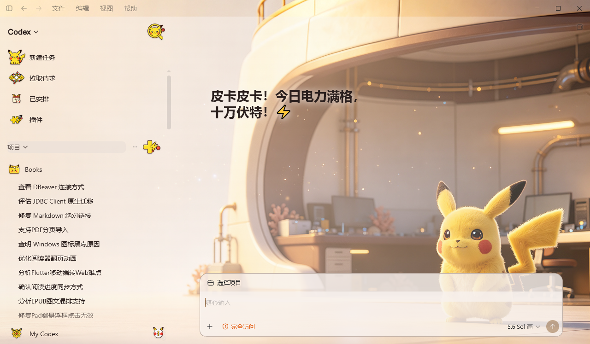
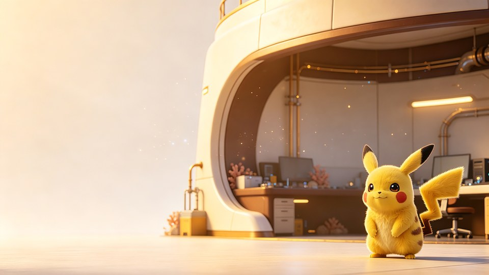

# ChatGPT Pika Theme

为 Windows Codex / ChatGPT 桌面端制作的非官方皮卡丘主题包，基于
[Fei-Away/Codex-Dream-Skin](https://github.com/Fei-Away/Codex-Dream-Skin) 的
Codex Dream Skin Studio 运行。

主题包包含：

- `皮卡丘·电光实验室（浅色）`
- `皮卡丘·电光实验室（深色）`
- 9 枚自绘卡通侧边栏图标
- 深色任务页、输入框底栏和输出面板文字兼容
- 一键安装、切换和卸载脚本

## Codex 实际效果

下面是浅色主题在 Windows Codex 桌面端中的实际运行截图，包含自绘的新建任务、
拉取请求、已安排、插件、项目、搜索、添加、设置和帮助图标。



## 背景预览




## 前置条件

1. Windows 10 或 Windows 11。
2. 已安装并至少成功运行一次 Codex Dream Skin Studio。
3. 安装目录默认为：
   `%LOCALAPPDATA%\CodexDreamSkinStudio`
4. Studio 需要支持 `icons.style: cartoon` 和
   `data-dream-cartoon-icon`。安装脚本会在写入前检查，不兼容时会安全停止。

## 一键安装

在 PowerShell 7 中运行：

```powershell
git clone https://github.com/MINI2436/chatgpt-pika-theme.git
cd chatgpt-pika-theme
pwsh -NoProfile -ExecutionPolicy Bypass -File .\scripts\install.ps1 -Apply light
```

`-Apply` 支持：

- `light`：安装后立即应用浅色主题，默认值。
- `dark`：安装后立即应用深色主题。
- `none`：只安装，不切换当前主题。

如果暂时不希望重载皮肤，可追加 `-NoRestart`。

## 切换主题

安装完成后，也可以通过系统托盘切换：

```text
Codex Dream Skin
  → 已保存主题
  → 皮卡丘·电光实验室（浅色 / 深色）
  → 应用或重新应用
```

如果界面没有立即刷新，运行：

```powershell
pwsh -NoProfile -ExecutionPolicy Bypass `
  -File "$env:LOCALAPPDATA\CodexDreamSkinStudio\scripts\start-dream-skin.ps1"
```

## 卸载主题包

请先在托盘中切换到其他主题，然后运行：

```powershell
pwsh -NoProfile -ExecutionPolicy Bypass -File .\scripts\uninstall.ps1
```

卸载脚本只会删除本仓库安装的两个已保存主题，并移除带有
`chatgpt-pika-theme` 标记的图标 CSS，不会覆盖或恢复整份 Dream Skin 文件。

## 自定义安装目录

如果 Studio 不在默认路径：

```powershell
pwsh -NoProfile -ExecutionPolicy Bypass -File .\scripts\install.ps1 `
  -StudioRoot "D:\Apps\CodexDreamSkinStudio" -Apply dark
```

## 本地校验

```powershell
pwsh -NoProfile -ExecutionPolicy Bypass -File .\scripts\validate.ps1
```

## 目录结构

```text
themes/     两套 Dream Skin 主题配置和背景图
icons/      9 枚透明 PNG 侧边栏图标
previews/   主题预览图
scripts/    安装、卸载和校验脚本
```

## 授权与声明

安装脚本采用 MIT License。主题图片及角色相关说明见
[ASSET-LICENSE.md](ASSET-LICENSE.md)。本项目是非官方同人主题，与 Nintendo、
The Pokémon Company、Game Freak、Creatures Inc.、OpenAI 均无隶属或赞助关系。
